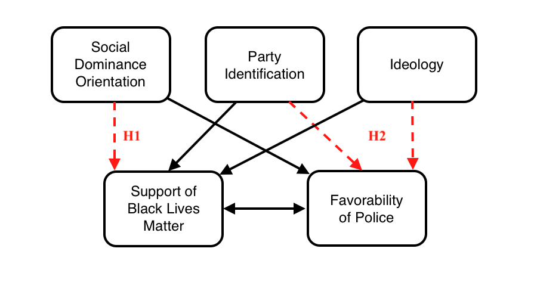

# BLM-police-favorability

<!-- -->

The Black Lives Matter movement and attitudes towards the police drastically shifted after the George Floyd protests reignited racial tensions in America. I build upon existing literature by examining how social dominance orientation, party identification, and ideology impact White attitudes towards the Black Lives Matter movement and the police using survey data collected to measure social dominance and attitudes towards these topics. My findings show that social dominance orientation has a significant effect on White attitudes towards Black Lives Matter even after controlling for party, ideology, and other demographic controls. They also show that while party identification and ideology do not affect White attitudes towards the police, social dominance orientation also does not while controlling for attitudes towards Black Lives Matter. These findings suggest that White attitudes towards these two intertwined topics are not the same and that social dominance orientation may not impact White attitudes in the same way for different topics.

*Note: Replication data kept private*
